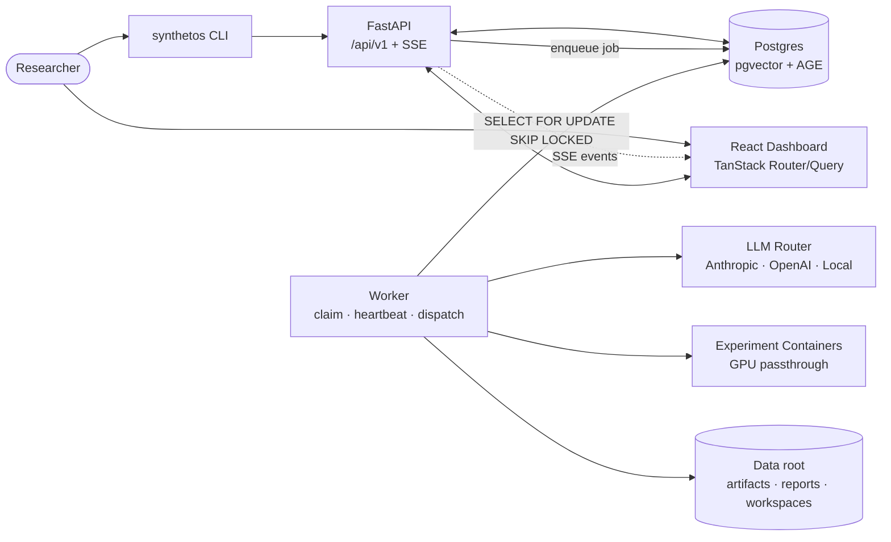
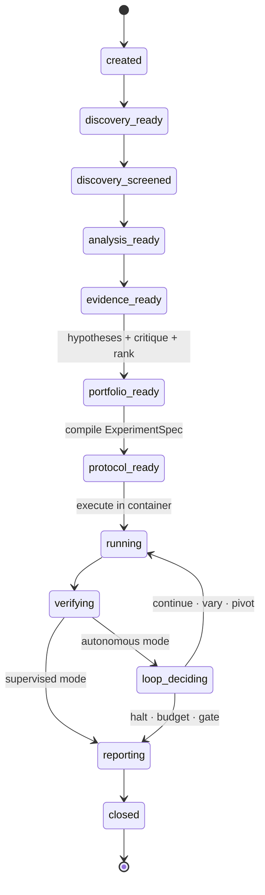
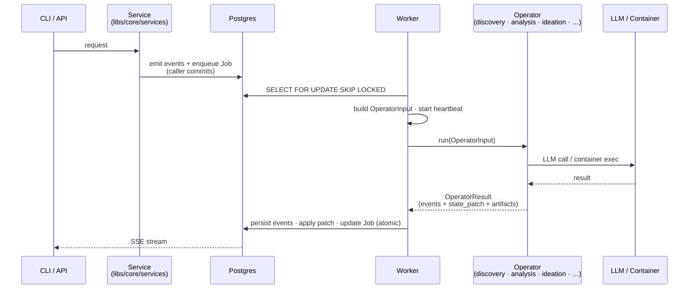

# Synthetos

Synthetos is a single-user ML research system that runs end-to-end research
loops. You define a problem; Synthetos triages the literature (arXiv +
internal corpus), generates and ranks hypotheses, compiles executable
protocols, runs experiments in isolated GPU-capable containers, verifies the
results, and learns across cycles via a canonical pattern memory.

Synthetos is an agentic research system, but the agency lives in code, not
in an LLM control loop. Typed operators read and write a shared
`ResearchState`; a worker claims jobs with `SELECT FOR UPDATE SKIP LOCKED`;
the state machine, budgets, gates, and repetition detection are
deterministic Python. LLMs are called inside operators for the probabilistic
parts — synthesis, ideation, critique — but they don't decide what runs
next. Every state change emits a `DomainEvent` so the React dashboard, SSE
stream, and CLI see the same truth.

## Disclaimer

Synthetos is an active, single-researcher project and should be treated as
a **work in progress, not a stable product**. Expect the repo to change
substantially from week to week:

- **No stability guarantees.** Database schemas, API routes, CLI
  subcommands, operator contracts, event payloads, config keys, and
  on-disk artifact layouts can all change without a deprecation window.
  Migrations may be squashed or rewritten; pinning to a commit SHA is the
  only safe way to depend on a specific behavior.
- **Coverage is uneven.** Some surfaces (discovery, analysis, experiment
  kickoff, pattern memory) are exercised end-to-end; others (protocol
  compilation, run creation, pattern curation, autonomy policy updates)
  are API/dashboard-only today and may move around as the CLI catches up.
  Real-environment validation is still focused on the discovery → analysis
  → experiment chain with live Docker/GPU execution.
- **Built for one researcher on one machine.** Auth, multi-tenant
  isolation, horizontal scaling, and operational hardening are explicitly
  out of scope. `LAB_ENV=dev` bypasses browser auth; `prod` exists but has
  not been battle-tested.
- **Expect rough edges.** Error messages, empty states, and recovery paths
  improve opportunistically rather than on a schedule. If something looks
  half-finished, it probably is.

If you're evaluating Synthetos, clone a specific commit, run the
`ml_baseline_small` pilot, and treat anything beyond that as exploratory.
Issues and design discussion are welcome; production use is not the goal (yet).

## Features

- **Literature triage** — internal arXiv corpus (pre-embedded with
  `gte-modernbert`, 768-dim) plus live arXiv, with Stable/Discovery views,
  rerank, and metadata-first screening.
- **Paper analysis** — HTML-first ingest with Docling PDF fallback, a typed
  paper graph (Apache AGE, relational fallback), graph-aware QA, coverage
  checks, and evidence extraction.
- **Hypothesis portfolio** — generation, critique, ranking, and a
  lifecycle (`active | promising | stalled | deprioritized | validated`)
  managed by the loop.
- **Protocol compiler** — turns a hypothesis card into a concrete
  `ExperimentSpec` (code plan, controls, metrics, baseline).
- **Isolated execution** — workspace setup, containerized run, capture,
  telemetry; experiment containers are spawned as GPU-capable siblings.
- **Verification & postmortems** — baseline checks, auto-remediation,
  directional signals, frontier tracking, next-step recommendations.
- **Autonomous loop** — opt-in per cycle, with run / wall-clock /
  per-hypothesis budgets, configurable checkpoint gates, spec-repetition
  detection, and completion reports.
- **Cross-charter pattern memory** — postmortems, remediations, directional
  signals, frontiers, and loop decisions consolidate into typed
  `canonical_patterns`; high-confidence `auto` patterns inject into
  ideation, remediation, and loop decisions; `curated` patterns require
  explicit approval; decay demotes stale patterns
  (`auto → curated → deprecated`).
- **Skill system** — file-based skill discovery with SHA-256 content
  hashes and first-party vs user-local trust tiers, enforced at runtime.
- **Pilot harness** — contract-validated fixtures (CPU smoke, classical ML,
  small vision) that drive the full chain and grade the result against
  expectations.
- **Control surfaces** — FastAPI control plane under `/api/v1` with SSE
  telemetry, a React 19 + TanStack dashboard, and a `synthetos` Typer CLI
  that mirrors the API.

## Strategy

Synthetos makes a few opinionated bets that shape every design decision:

- **Deterministic core, probabilistic edge.** State, transitions, budgets,
  gates, and lineage are plain Python and Postgres rows. LLMs are confined
  to operator bodies — synthesis, ideation, critique, report writing — so
  the parts that have to be correct are not prompt-dependent.
- **Operators over shared state, not agents over messages.** There is no
  planner LLM, no message bus, no hidden prompt history. Each operator is
  a typed function `OperatorInput → OperatorResult` reading and patching
  `ResearchState`. What ran, why, and in what order is reconstructable
  from the event log without replaying an LLM.
- **Hexagonal adapters at every external boundary.** LLM providers,
  embeddings, paper sources, rerankers, ingestion, and graph storage all
  sit behind interfaces in `libs/adapters/`. Core domain code does not
  import vendor SDKs, so providers are swappable (Anthropic ↔ OpenAI ↔
  local Ollama/vLLM) and degradations are graceful (AGE → relational,
  rerank → fallback).
- **Metadata-first triage.** Title + abstract screening runs before any
  full-text fetch; full text is HTML-first with Docling PDF as fallback.
  This keeps the literature loop cheap enough to run often and reserves
  expensive parsing for papers that earned it.
- **Event-sourced truth.** Every state change is a `DomainEvent` row. The
  dashboard's SSE stream, the CLI, and postmortems all read the same
  log — no separate "audit" vs "runtime" views to drift apart.
- **Learn across cycles, not just within one.** Postmortems, remediations,
  directional signals, frontiers, and loop decisions consolidate into
  canonical patterns that inject back into ideation, remediation, and loop
  decisions on future cycles. The system gets less naïve the more it
  runs.
- **Single-user, single-GPU pragmatism.** One active charter at a time,
  local Postgres, host-side API/worker/CLI with sibling containers for
  experiments. No Kubernetes, no multi-tenant auth, no distributed queue.
  Complexity is spent on the research loop, not on infrastructure the
  single-researcher use case doesn't need.
- **Autonomy is opt-in and bounded.** Autonomous mode is a per-cycle flag
  with explicit run, wall-clock, and per-hypothesis budgets; configurable
  checkpoint gates that pause for approval; and spec-repetition detection
  that escalates from *continue* to *vary* to *pivot* automatically. The
  default posture is supervised.

## Architecture

### System components



### Research loop (per cycle)



### Queue-driven operator pattern



## Quickstart

### Prerequisites

- Python 3.12+
- Node.js 20+
- Docker Desktop (Postgres with pgvector + AGE; also used for experiment containers)
- Optional: Anthropic API key for hosted model roles
- Optional: a local OpenAI-compatible endpoint (LMStudio / Ollama / vLLM) on port 11434 for local roles — see [`configs/models.yaml`](configs/models.yaml)
- Optional (GPU pilot): an Nvidia or Apple Silicon GPU with ≥ 8 GB VRAM

### 1. Install and start Postgres

```bash
uv sync --extra dev
docker compose up -d postgres
uv run synthetos db init
```

If Postgres is not on the default local creds, set `LAB_DB_URL` first so
Alembic and the app target the same instance.

### 2. Start the three processes

In three terminals:

```bash
# API (port 8000, OpenAPI at /docs)
uv run uvicorn apps.api.main:app --reload

# Worker — handles all operators + periodic loop (stale-job reclaim, pattern decay)
uv run python -m apps.worker

# Web dashboard (port 5173)
cd apps/web && npm install && npm run dev
```

### 3. Drive a research cycle

Via the dashboard at `http://localhost:5173`, or the CLI:

```bash
uv run synthetos charter create "My research question"
uv run synthetos cycle create <charter_uuid>
uv run synthetos discovery run --charter-id <charter_uuid> --query "..."
uv run synthetos analysis run --paper-id <paper_uuid> --charter-id <charter_uuid> --cycle-id <cycle_uuid>
uv run synthetos experiment hypothesize --cycle-id <cycle_uuid> --charter-id <charter_uuid>

# Inspect autonomy state for this cycle
uv run synthetos autonomy policy --cycle-id <cycle_uuid>
```

Protocol compilation, run creation, and autonomy policy updates are currently
available through the dashboard and API (`POST /api/v1/protocols/compile`,
`POST /api/v1/runs`, `PUT /api/v1/cycles/{cycle_id}/autonomy/policy`). The CLI
covers discovery, analysis, hypothesis kickoff, inspection, and run controls.

### 4. Or run a bundled pilot

```bash
uv run synthetos pilot list
uv run synthetos pilot run ml_baseline_small              # CPU, < 5 min, CI-safe
uv run synthetos pilot evaluate ml_baseline_small <cycle_uuid>
```

Bundled fixtures in [`configs/problems/`](configs/problems/):

| Fixture | Profile | CI-safe |
|---|---|---|
| `ml_baseline_small` | CPU, supervised, < 5 min | ✅ |
| `ml_sklearn_iris` | CPU, autonomous, 10-run / 30-min budget | ✅ |
| `ml_vision_tiny` | GPU, autonomous, 6-run / 2-hour budget | ❌ |

`synthetos pilot run` creates (or reuses) a `pilot:<problem_id>` charter so
repeat runs share one pattern-learning history. `synthetos pilot evaluate`
grades the cycle against the fixture's `expected.yaml` and writes
`artifacts/pilot/<problem_id>/<timestamp>/evaluation.{json,md}`.

## Dashboard surface

- **Dashboard** (`/`) — charter list, active jobs
- **Charters** (`/charters`) — create and drive a charter; per-charter discovery, analysis, experiment, and autonomy panels
- **Events** (`/events`) — live SSE event stream across charters
- **Cycle timeline** (`/cycles/$cycleId/timeline`) — phase-grouped live events for one cycle
- **Patterns** (`/patterns`, `/patterns/$patternId`) — canonical pattern list with filters, bulk `Consolidate now` / `Run decay`, and per-pattern approve / reject / trust-tier curation
- **Skills** (`/skills`) — skill registry and discovery

Reports (discovery, analysis, autonomy completion) render rich markdown.

## CLI reference

The `synthetos` CLI covers the main local workflows and inspection paths:

```bash
uv run synthetos charter create "My research question"
uv run synthetos cycle create <charter_uuid>
uv run synthetos discovery run --charter-id <charter_uuid> --query "..."
uv run synthetos analysis run --paper-id <paper_uuid> --charter-id <charter_uuid> --cycle-id <cycle_uuid>
uv run synthetos experiment hypothesize --cycle-id <cycle_uuid> --charter-id <charter_uuid>
uv run synthetos experiment runs --cycle-id <cycle_uuid>
uv run synthetos experiment status --run-id <run_uuid>
uv run synthetos autonomy policy --cycle-id <cycle_uuid>
uv run synthetos patterns consolidate
uv run synthetos patterns decay --force
uv run synthetos pilot list
uv run synthetos pilot run ml_baseline_small
uv run synthetos pilot evaluate ml_baseline_small <cycle_uuid>
uv run synthetos pilot compare <left> <right>
```

Some write paths are API/dashboard-only today, notably protocol compilation,
run creation, pattern browsing/curation, and autonomy policy updates.

## Quality gates

Run before shipping:

```bash
uv run ruff check .
uv run pyright
uv run pytest
cd apps/web && npm run build
```

## Key configuration

All settings use the `LAB_` env prefix (stripped in
[`libs/core/config.py`](libs/core/config.py)):

| Var | Default | Purpose |
|---|---|---|
| `LAB_ENV` | `dev` | `dev` bypasses browser auth; `prod` requires bearer tokens |
| `LAB_DB_URL` | local docker creds | Postgres DSN (psycopg) |
| `LAB_DATA_ROOT` | `data` | Artifact / report / workspace root |
| `LAB_MODEL_CONFIG` | `configs/models.yaml` | Role → provider / model routing |
| `LAB_SKILL_PATHS` | `skills` | Colon-separated skill discovery roots |
| `LAB_JOB_HEARTBEAT_TIMEOUT_S` | `120` | Stale-job reclaim threshold |
| `LAB_JOB_MAX_RECLAIMS` | `3` | Reclaims before a job is force-failed |
| `LAB_WORKER_PERIODIC_TICK_S` | `30` | Worker periodic-loop interval |
| `LAB_PATTERN_DECAY_INTERVAL_H` | `24` | Minimum interval between auto-enqueued decay jobs |
| `LAB_PATTERN_MAX_STALENESS_DAYS` | `90` | Staleness window past which auto patterns demote |

Per-cycle pattern and skill policy lives in `ResearchCycle.config`:

```yaml
patterns:
  min_confidence_auto: 0.7
  max_staleness_days: 90
  cross_charter_weight_boost: 1.15
  cross_charter_only: false
  injection_limit: 10
skills:
  require_first_party_for_execution: false
```

## Notes

- Apache AGE is optional — Synthetos falls back to relational tables when AGE is unavailable.
- Browser auth is bypassed in `LAB_ENV=dev`; production requires bearer tokens with scoped access (`patterns.read`, `patterns.write`, `cycles.write`, etc.).
- The arXiv metadata corpus is already downloaded and embedded. Full text is fetched only for shortlisted papers.
- One active charter at a time is assumed due to single-GPU constraints.
- The repo includes autonomy, canonical-pattern, and pilot surfaces, but real-environment validation is still focused on discovery → analysis → experiment integration and live Docker/GPU execution.
